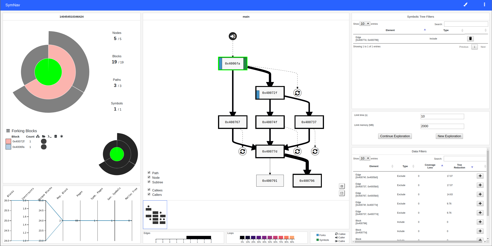
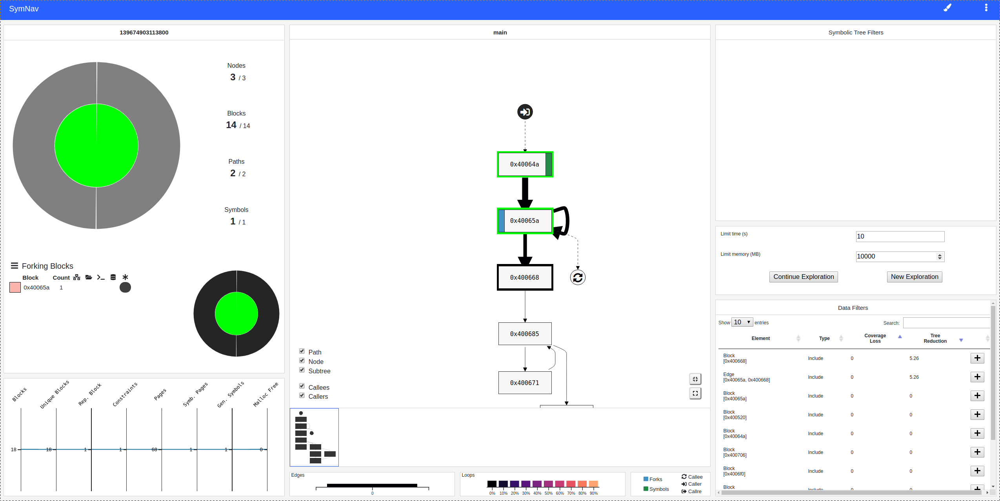
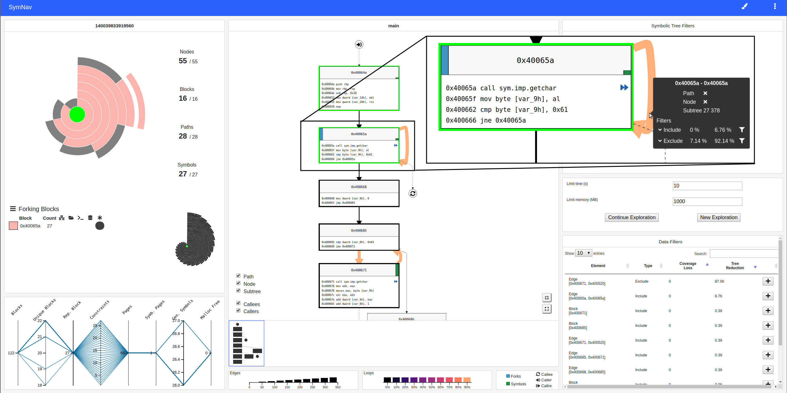

# SymNav - Visually Assisting Symbolic Execution



SymNav is a prototype tool that visualizes the state of a symbolic execution analysis by plotting relevant data on a sunburst (that represent the symbolic execution tree), and on the control flow graph of the program. Furthermore, the tool allows the user to interact and refine the analysis, allowing him to interactively prune the symbolic execution tree. 

With the help of the tool, the user can grasp properties of the ongoing analysis and use such insights to refine the symbolic exploration process.

### Installation
Install `Chromium` and `radare2`. 
Create a virtual environment and install the required pip packages. 
Using [virtualenvwrapper](https://virtualenvwrapper.readthedocs.io/en/latest/):
``` bash
$ mkvirtualenv --python=`which python3` symnav
$ pip3 install -r requirements.txt
```

### Example of Use
In order to present some features of SymNav, we will use a simple [program](examples/simple-loop.c):
``` C
#include <stdio.h>

int main(int argc, char const *argv[])
{
  char a;
  while((a = getchar()) != 'a');

  unsigned i, v;
  for (i=0; i<100; ++i)
    v += (unsigned)(getchar() ^ a);

  if (v != 0xbad)
    return 1;
  return 0;
}
```
it reads some data from stdin, compute a value using the data (stored in `v`), and checks whether the value is equal to the constant `0xbad`. You can find a compiled version of the program in `examples/simple-loop`.

We can run SymNav on the program by running:
``` bash
$ symnav ./examples/simple-loop
```

after running the command, SymNav will execute the program symbolically until the first fork take place. The resulting view, after selecting the root of the sunburst, is the following:

We can locate the first fork at block `0x40065a` but we cannot derive much other information from the view. 

We can resume the exploration by opening the right menu (click on the three dots in the top right corner), by specifying a time and memory budget and by clicking on `Continue Exploration` on the right side. We can specify 10 seconds and 1000 MB of RAM and resume the exploration to collect more information.

After the 10 seconds, the GUI is updated. After selecting the root of the sunburst, the resulting view is the following:


Now, the view is richer: on the left-hand side, we can see the sunburst that represent the symbolic execution tree, which contains all the explored paths. 
Near the tree, we can see other information:
- the number of nodes in the symbolic execution tree (55)
- the number visited basic blocks (16)
- the number of paths (i.e., states) in the current symbolic execution tree (28)
- the number of generated symbols (27) 
- the list of basic blocks that caused a fork (only 0x40065a)

In the middle, we can see the control flow graph of the program, enriched with data from the symbolic execution engine. In particular:
- thick edges indicate that the edge has been visited by at least one state
- light coloured edges indicate that the edge has been visited multiple times by the same states (i.e., a loop)
- the thick green or black border of a block indicates that the block has been visited by at least one state
- the blue bar on top of a block indicate that the block generated new states
- the green bar on top of a block indicate that the block generated new symbols

We can see that the block `0x40065a` repeatedly generate states. Indeed, the basic block corresponds to `while((a = getchar()) != 'a')`: the program is waiting for an `a` from stdin.

To avoid the useless state generation, we can cut this edge from the GUI (by using the Exclude filter in the popup menu) and discard all the states that passed through that edge.

Now, we can again resume the exploration and continue our analysis.

---

To have more information, refer to our [paper](https://www.researchgate.net/profile/Daniele_Cono_DElia/publication/336220800_SymNav_Visually_Assisting_Symbolic_Execution/links/5d94eb70299bf1c363f2ba4f/SymNav-Visually-Assisting-Symbolic-Execution.pdf).

If you are planning on using our tool in your research, we would be grateful if you can consider referencing it using the following BibTeX entry:
```
@inproceedings{SymNav-VizSec19,
  author = {Angelini, Marco and Blasilli, Graziano and Borzacchiello, Luca and Coppa, Emilio and D'Elia, Daniele Cono and Demetrescu, Camil and Lenti, Simone and Nicchi, Simone and Santucci, Giuseppe},
  title = {SymNav: Visually Assisting Symbolic Execution},
  booktitle = {Proceedings of the 15th IEEE Symposium on Visualization for Cyber Security},
  series = {VizSec '19},
  year = {2019}
}
```

### Developers
- Graziano Blasilli [@blasilli](https://github.com/blasilli)
- Luca Borzacchiello [@borzacchiello](https://github.com/borzacchiello)
- Simone Lenti [@simone-lenti](https://github.com/simone-lenti)
